# 🧠 Part 1: C Fundamentals for Embedded Systems (Questions 1-15)

## 📌 Question 1: What does the `volatile` keyword do?

### 💡 The Concept

The `volatile` keyword tells the compiler: **"Hey, this variable can change unexpectedly! Do not optimize reads/writes to it."**

In embedded systems, values can change due to hardware (like a status register changing when a button is pressed) without the code explicitly changing it.

### 🖼️ Visualization (Compiler Optimization vs Volatile)

Without `volatile`, the compiler thinks it's smart and caches the value. With `volatile`, it reads from memory every time.

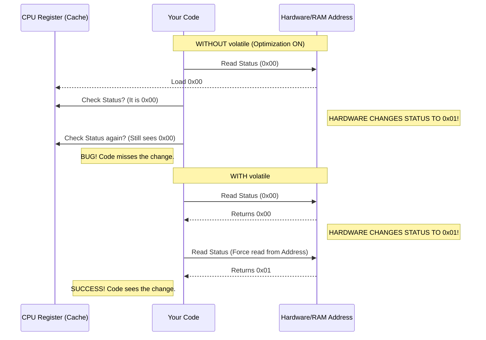

### 💻 Code Example

```c
// Pointer to a hardware status register at address 0x4000
volatile uint8_t *status_reg = (uint8_t *)0x4000;

void wait_for_button() {
    // Without volatile, compiler might replace this loop with 'while(0)' or infinite loop
    while (*status_reg == 0) {
        // Wait for hardware to set bit to 1
    }
}
```

---

## 📌 Question 2: `static` Keyword Uses

### 💡 The Concept

1.  **Inside a function**: Variable retains value between calls.
2.  **Global variable/function**: Limits scope to **this file only** (Private).

### 🖼️ Visualization (`static` vs Local)

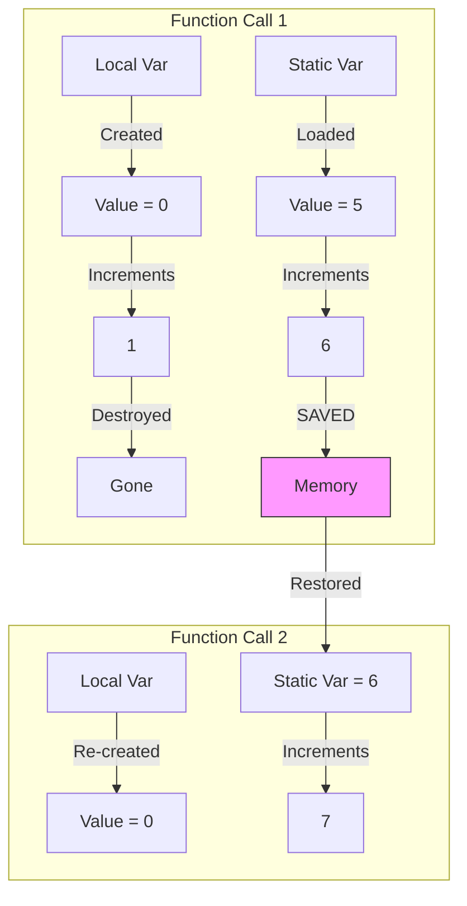

### 💻 Code Example

```c
void counter() {
    static int count = 0; // Initialized only ONCE
    int temp = 0;         // Re-initialized EVERY call

    count++;
    temp++;
    printf("Static: %d, Local: %d\n", count, temp);
}

// Call 1: Static: 1, Local: 1
// Call 2: Static: 2, Local: 1 (Static remembers!)
```

---

## 📌 Question 3: `const` vs `#define`

### 💡 The Concept

- `#define`: Text replacement by preprocessor. No type checking. No memory address (usually).
- `const`: Actual variable in memory (usually Read-Only data). Type safe. Debuggable.

### 🖼️ Visualization

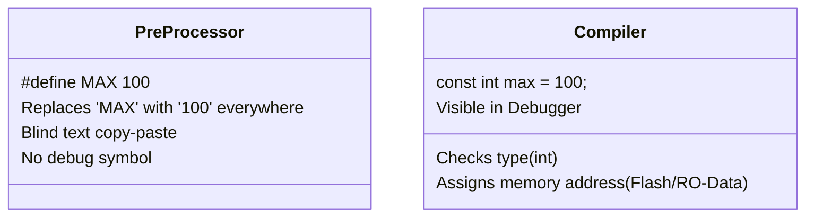

### 💻 Code Example

```c
#define BUFFER_SIZE 256        // Dangerous if used wrong (e.g., math order)
const int kBufferSize = 256;   // Safer, typed.

int arr[kBufferSize]; // Works in modern C
```

---

## 📌 Question 4: `const` Pointers (Calculus of Const)

### 💡 The Concept

Read it backwards (Right-to-Left)!

- `const int *ptr` -> Pointer to a constant integer. (Can change pointer, can't change value).
- `int * const ptr` -> Constant pointer to integer. (Can change value, can't change pointer).

### 🖼️ Visualization

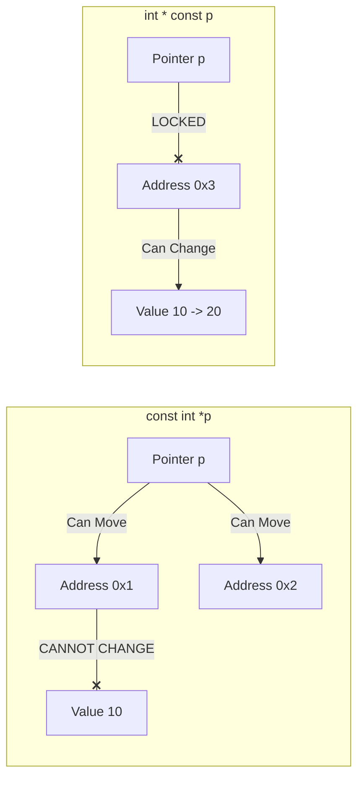

### 💻 Code Example

```c
int x = 10;
int y = 20;

// Case 1: Pointer to const
const int *ptr1 = &x;
*ptr1 = 30; // ERROR! Value is const.
ptr1 = &y;  // OK. Pointer can move.

// Case 2: Const pointer
int * const ptr2 = &x;
*ptr2 = 30; // OK. Value can change.
ptr2 = &y;  // ERROR! Pointer is locked.
```

---

## 📌 Question 5: Little Endian vs Big Endian

### 💡 The Concept

How are multi-byte numbers stored in memory?

- **Little Endian**: Least Significant Byte (LSB) at Lowest Address (Intel/ARM default).
- **Big Endian**: Most Significant Byte (MSB) at Lowest Address (Network/Motorola).

### 🖼️ Visualization

Value: `0x12345678` stored at address `0x100`.

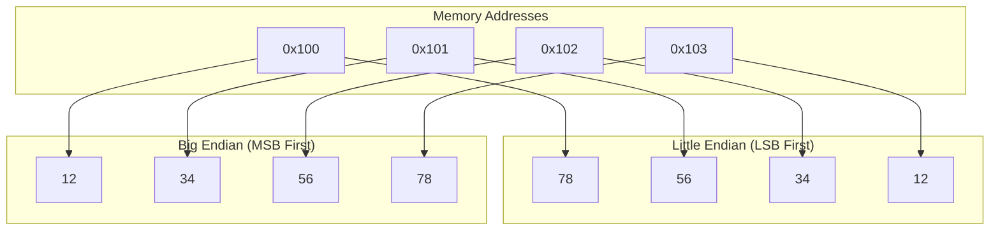

### 💻 Code Example (Check Endianness)

```c
int check_endian() {
    unsigned int x = 1;
    char *c = (char*)&x;
    // x = 0x00000001
    // If Little Endian: c points to 0x01
    // If Big Endian:    c points to 0x00
    if (*c) {
        return 1; // Little Endian
    } else {
        return 0; // Big Endian
    }
}
```

---

## 📌 Question 6: Structure Packing & Padding

### 💡 The Concept

Processors fetch memory in chunks (e.g., 4 bytes). Variables are "aligned" for speed. The compiler adds "padding" (wasted space) to align data.

### 🖼️ Visualization

`struct { char a; int b; char c; }`

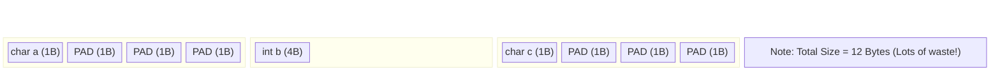

**Packed (Reordered):** `struct { int b; char a; char c; }`

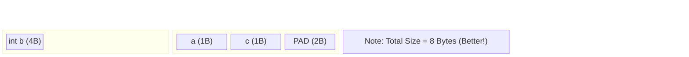

### 💻 Code Example

```c
struct MyStruct {
    char a;
    int b;
} __attribute__((packed)); // GCC special to remove padding (Size = 5)

// Without packed, size would likely be 8.
// WARNING: Packed structs are slower to access on some CPUs!
```

---

## 📌 Question 7: Void Pointer (`void *`)

### 💡 The Concept

A generic pointer type. It has no type associated with it. Can point to anything.
**Rule**: You generally **cannot** dereference it directly. You must cast it first.

### 🖼️ Visualization

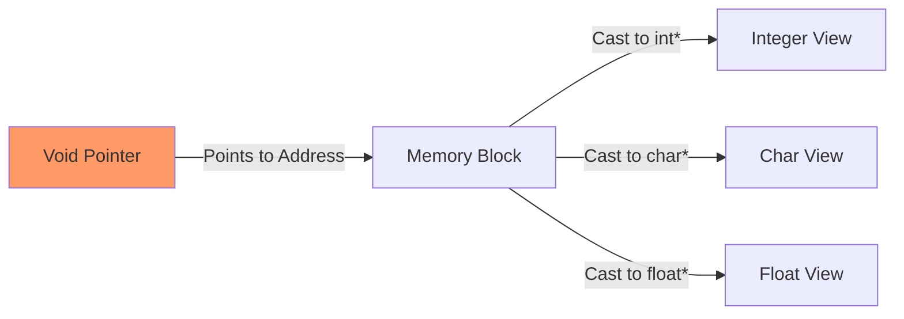

### 💻 Code Example

```c
void print_data(void *data, char type) {
    if (type == 'i') {
        printf("%d", *(int*)data); // Cast to int* then dereference
    } else if (type == 'f') {
        printf("%f", *(float*)data);
    }
}
```

---

## 📌 Question 8: Function Pointers

### 💡 The Concept

A pointer that stores the address of a function, not a variable. Used for **Callbacks** and **State Machines** in embedded C (to simulate polymorphism).

### 🖼️ Visualization (Button Callback)

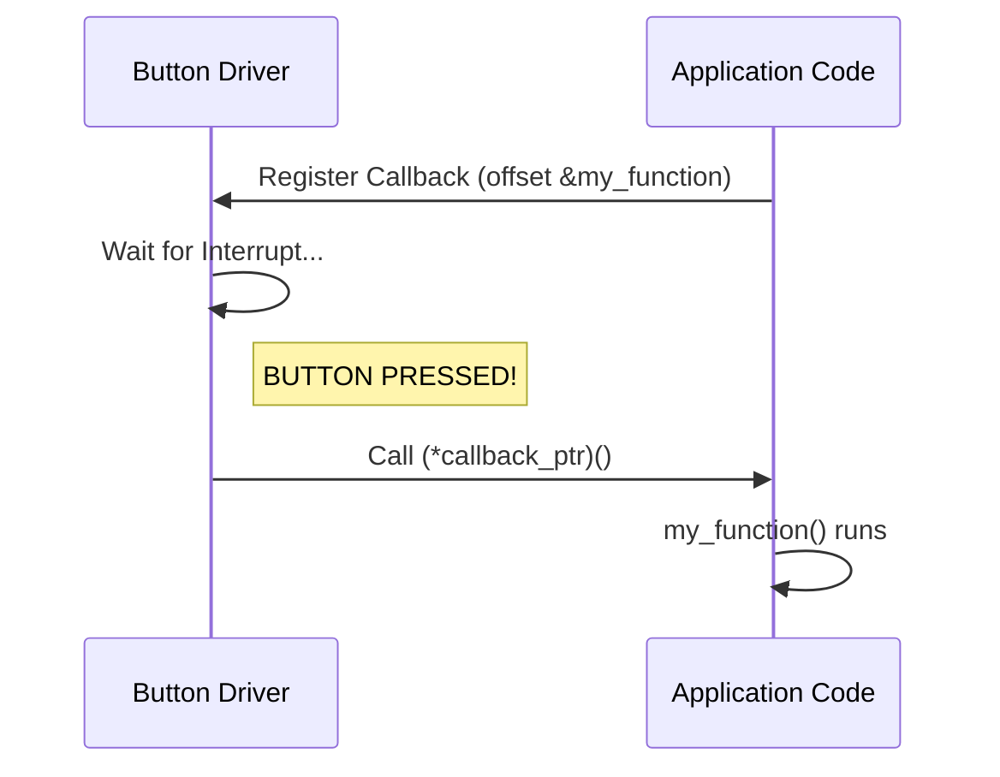

### 💻 Code Example

```c
void on_button_press() {
    printf("Button Clicked!");
}

int main() {
    // Declare function pointer
    void (*event_handler)(void);

    // Assign address
    event_handler = &on_button_press;

    // Call it
    (*event_handler)(); // Output: Button Clicked!
}
```

---

## 📌 Question 9: `inline` vs Macro

### 💡 The Concept

- **Macro**: Text replacement. Fast but dangerous (side effects, no type check).
- **Inline**: Compiler optimization. Inserts function body into code. Type safe.

### 🖼️ Visualization

**Macro Hazard:** `#define SQUARE(x) (x*x)`
`SQUARE(a++)` -> `(a++ * a++)`. Increments `a` TWICE! 💥

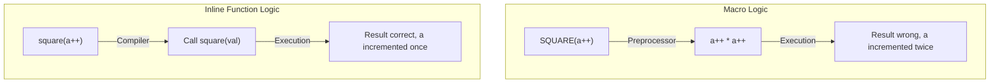

---

## 📌 Question 10: Array vs Pointer (`char a[]` vs `char *p`)

### 💡 The Concept

- `char a[] = "Hello"`: An array **on the stack** (modifiable).
- `char *p = "Hello"`: A pointer to a string literal in **Read-Only Memory** (modification = crash).

### 🖼️ Visualization

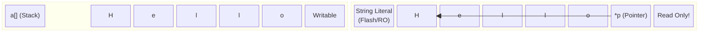

---

## 📌 Question 11: Bitwise XOR Swap Trick

### 💡 The Concept

Swapping two variables without a temporary variable.
(Common interview question, though rarely used in production due to readability).

A = A ^ B
B = A ^ B
A = A ^ B

### 🖼️ Visualization

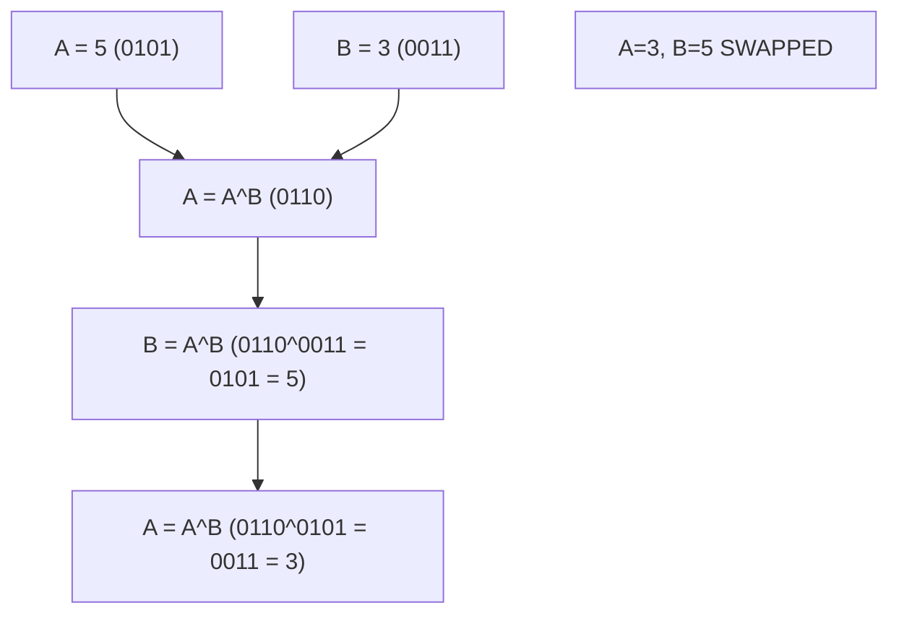

---

## 📌 Question 12: Stack vs Heap

### 💡 The Concept

- **Stack**: Fast, automatic, small. Stores local variables/returns. LIFO.
- **Heap**: Slow, manual (`malloc`), large. User manages lifetime. Fragmentation risk.

### 🖼️ Visualization

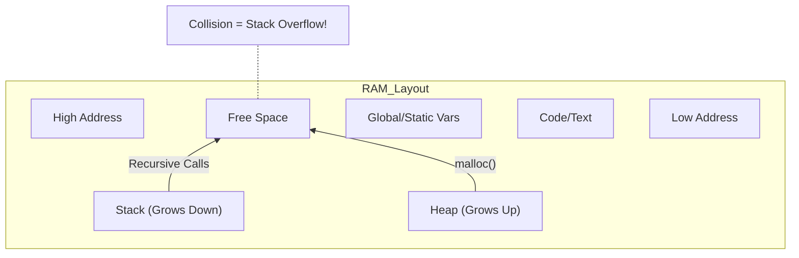

---

## 📌 Question 13: What is a memory leak?

### 💡 The Concept

Allocating memory on the Heap (`malloc`) but forgetting to free it (`free`). Over time, the heap fills up, and the system crashes.

### 🖼️ Visualization

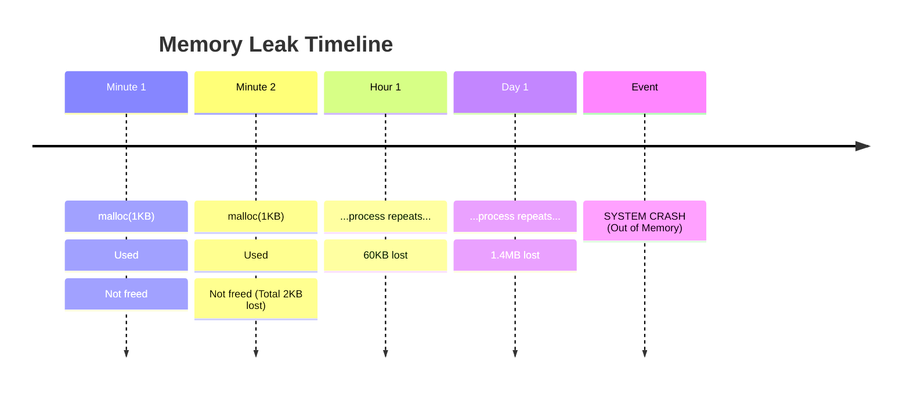

---

## 📌 Question 14: `NULL` pointer vs Unitialized Pointer

### 💡 The Concept

- **Uninitialized**: Points to random garbage. Access = Unknown behavior (usually crash).
- **NULL**: Points to `0x00` (Defined nothing). Access = Guaranteed Segfault/Crash (easy to debug).

Always initialize pointers to `NULL`!

### 🖼️ Visualization

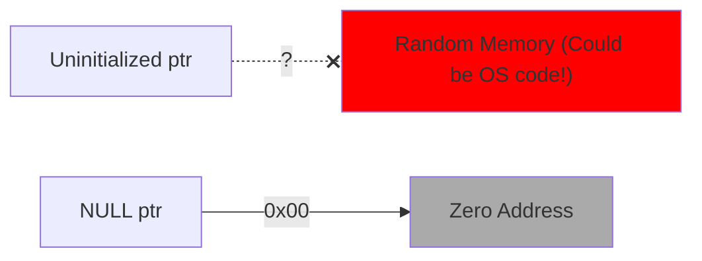

---

## 📌 Question 15: What is Recursion? Why avoid in Embedded?

### 💡 The Concept

Function calling itself.
**Embedded Warning**: Recursion eats the **Stack**. Embedded devices have small stacks (e.g., 1KB). Deep recursion = Stack Overflow = Hard fault.

### 🖼️ Visualization

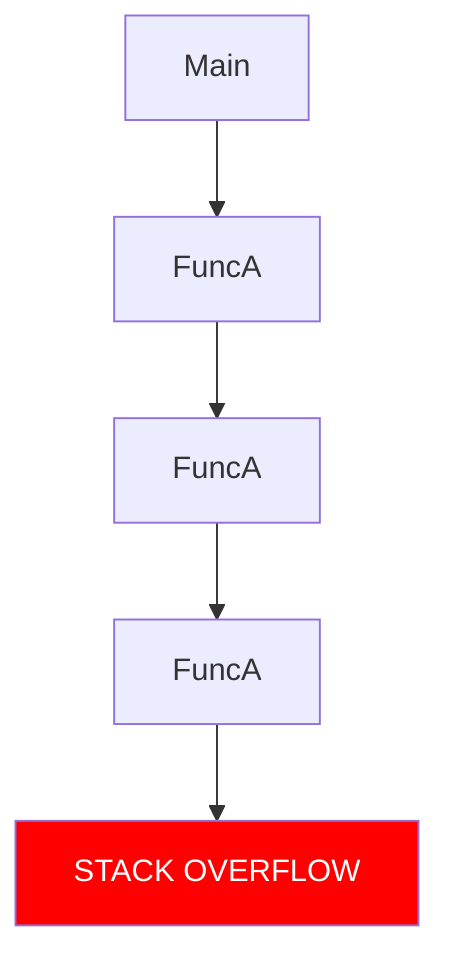
