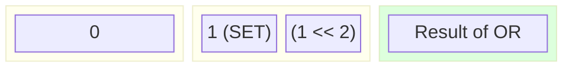
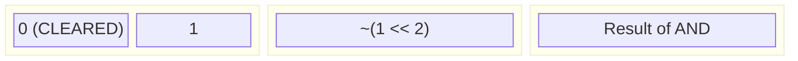
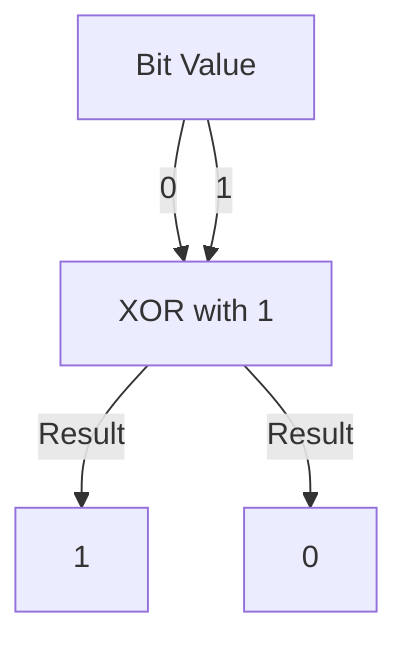
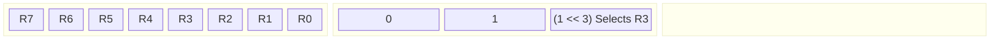
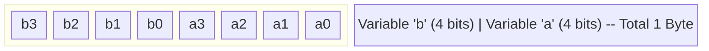
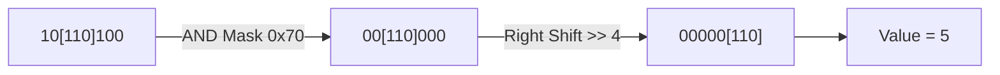
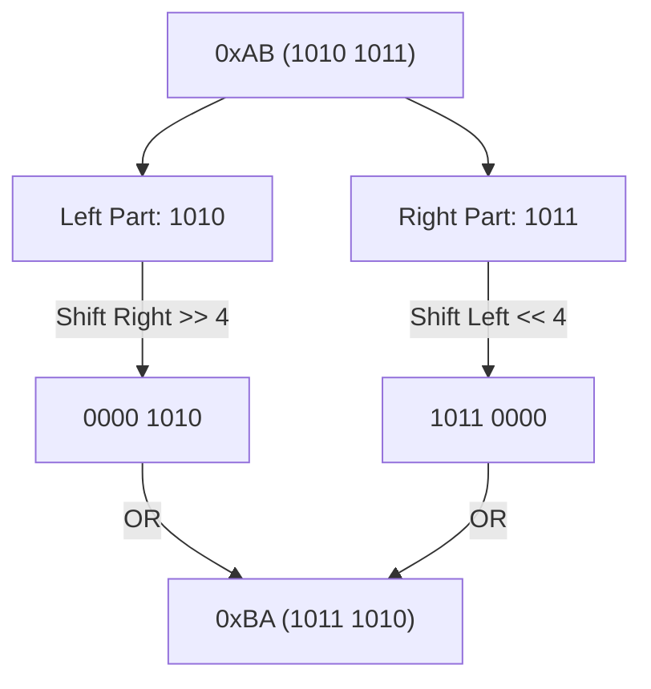
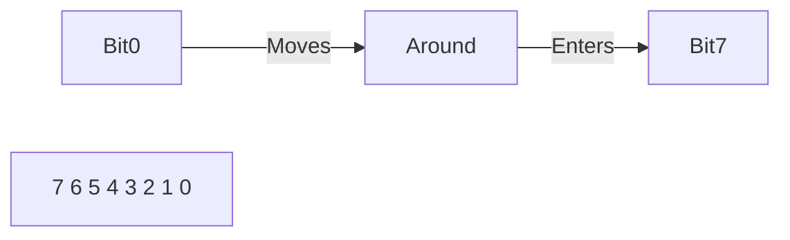
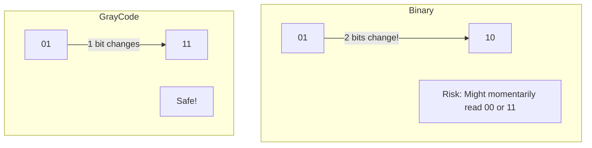

# 🧠 Part 2: Bit Manipulation & Registers (Questions 16-30)

## 📌 Question 16: Setting a Specific Bit

### 💡 The Concept

To force a bit to `1` without changing others, use **OR** (`|`) with a shifted `1`.
`REG |= (1 << n)`

### 🖼️ Visualization (Set Bit 2)



### 💻 Code Example

```c
#define LED_PIN 3 // Pin 3
uint8_t reg = 0x05; // 0000 0101

// Set bit 3
reg |= (1 << LED_PIN);
// Result: 0000 1101 (0x0D)
```

---

## 📌 Question 17: Clearing a Specific Bit

### 💡 The Concept

To force a bit to `0` without changing others, use **AND** (`&`) with an **inverted** mask (`~`).
`REG &= ~(1 << n)`

### 🖼️ Visualization (Clear Bit 2)



### 💻 Code Example

```c
uint8_t reg = 0x0D; // 0000 1101

// Clear bit 3
reg &= ~(1 << 3);
// Result: 0000 0101 (0x05)
```

---

## 📌 Question 18: Toggling a Specific Bit

### 💡 The Concept

To flip a bit (0->1 or 1->0), use **XOR** (`^`).
`REG ^= (1 << n)`

### 🖼️ Visualization



### 💻 Code Example

```c
// Toggle LED roughly every second
while(1) {
    LED_PORT ^= (1 << LED_PIN);
    delay_ms(1000);
}
```

---

## 📌 Question 19: Checking a Specific Bit state

### 💡 The Concept

To check if a bit is 1 or 0, **AND** it with a mask.
`if (REG & (1 << n))`

### 🖼️ Visualization



### 💻 Code Example

```c
if (STATUS_REG & (1 << RX_READY_BIT)) {
    // Read data
}
```

---

## 📌 Question 20: Bit Fields in Structs

### 💡 The Concept

A way to pack multiple variables into a single integer space. Very common in protocol headers (IP header, etc).

### 🖼️ Visualization

`struct { uint8_t a:4; uint8_t b:4; }`



### 💻 Code Example

```c
struct StatusRegister {
    uint8_t overflow : 1;  // 1 bit
    uint8_t ready : 1;     // 1 bit
    uint8_t mode : 2;      // 2 bits
    uint8_t reserved : 4;  // 4 bits padding
};
// Total size = 1 Byte
```

**Warning**: Endianness affects the order of bit fields! Can be risky for portability.

---

## 📌 Question 21: Extracting a Value (Mask & Shift)

### 💡 The Concept

Sometimes you need to read a multi-bit value (like a 3-bit mode) from the middle of a register.

1. Mask the bits.
2. Shift them down to 0.

### 🖼️ Visualization

Reg: `0b10110100` (Want bits 4-6, value `101` i.e., 5)



### 💻 Code Example

```c
#define MODE_MASK 0x70  // 0111 0000
#define MODE_SHIFT 4

uint8_t reg = 0xB4; // 1011 0100
uint8_t mode = (reg & MODE_MASK) >> MODE_SHIFT;
// mode = 5
```

---

## 📌 Question 22: What is `0xDEADBEEF`?

### 💡 The Concept

A "Magic Number". Used by developers to mark memory, identify crashes, or finding valid data structures in raw memory dumps. It's easily recognizable.

Other classics: `0xCAFEBABE` (Java), `0xBADF00D` (Malloc fail).

---

## 📌 Question 23: Swapping Nibbles (4 bits)

### 💡 The Concept

Swap the upper 4 bits and lower 4 bits of a byte.
`0xAB` -> `0xBA`

Formula: `((x & 0x0F) << 4) | ((x & 0xF0) >> 4)`

### 🖼️ Visualization



---

## 📌 Question 24: Count Leading Zeros (CLZ)

### 💡 The Concept

How many zeros before the first `1`? Useful for finding the highest priority interrupt or normalizing floating point numbers.
Hardware often has an instruction for this (`__builtin_clz(x)` in GCC).

### 🖼️ Visualization

Val: `0000 0001 0000 ....` (32 bit)


---

## 📌 Question 25: Circular Shift (Rotate)

### 💡 The Concept

Bits falling off one end reappear at the other. C has no native operator (only `<<`, `>>` lose bits), but CPUs have `ROL`/`ROR` instructions.

### 🖼️ Visualization (Rotate Right)



### 💻 Code Example

```c
// Rotate Right 8-bit value by n
uint8_t rotr8(uint8_t value, unsigned int count) {
    return (value >> count) | (value << (8 - count));
}
```

---

## 📌 Question 26: Clearing lowest set bit

### 💡 The Concept

`x & (x - 1)`
This removes the last `1`. Used to count set bits efficiently.

### 🖼️ Visualization

`x = 12 (1100)`


---

## 📌 Question 27: Power of 2 check

### 💡 The Concept

A number is a power of 2 if it has **exactly one** bit set.
(1, 2, 4, 8, 16...)

Formula: `(x != 0) && ((x & (x - 1)) == 0)`

---

## 📌 Question 28: Gray Code vs Binary

### 💡 The Concept

- **Binary**: 00, 01, 10, 11
- **Gray Code**: 00, 01, 11, 10 (Only 1 bit changes at a time!)

Critical for encoders (motors) and clock domain crossing to prevent glitch states.

### 🖼️ Visualization (Transition 1->2)



---

## 📌 Question 29: What is a 'Mask'?

### 💡 The Concept

A 'mask' is a binary pattern used to filter, select, or modify specific bits. It covers up (masks) the bits you don't care about.

Example: `0xFF` masks (selects) the lower 8 bits.

---

## 📌 Question 30: Read-Modify-Write (RMW)

### 💡 The Concept

When changing a register, you almost never want to simply write `REG = 0x01`. This overwrites _everything_.
You Read the current value, Modify specific bits, and Write it back.

Dangerous in interrupts (Race conditions!).

### 💻 Code Example

```c
// BAD (Overwrites other settings)
CR1 = 0x02;

// GOOD (RMW)
uint32_t val = CR1; // Read
val |= 0x02;        // Modify
CR1 = val;          // Write
```
