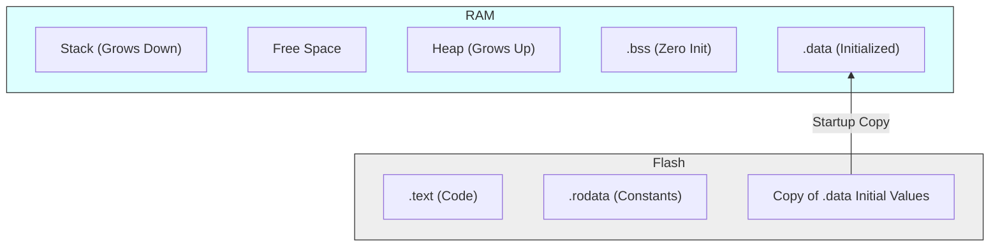
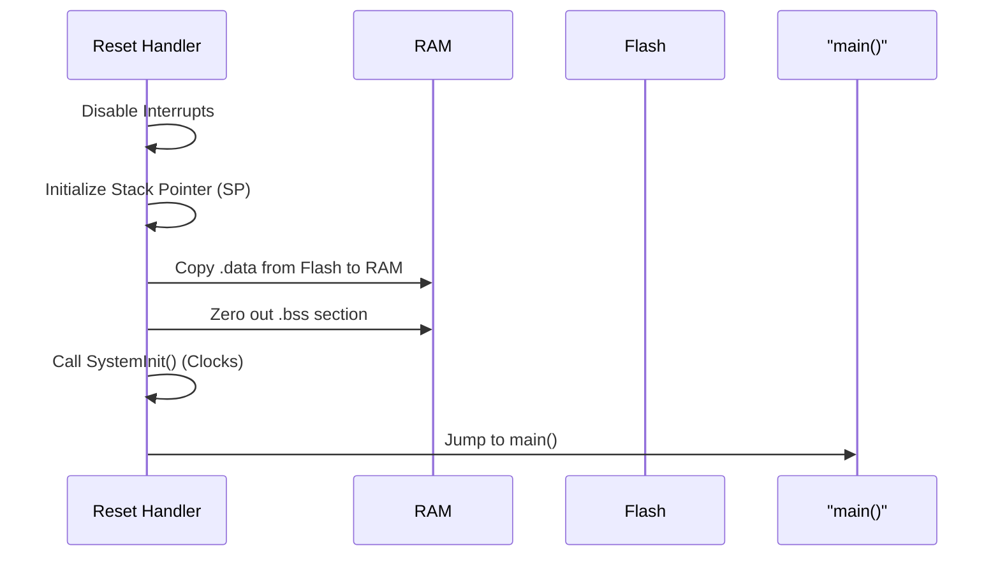
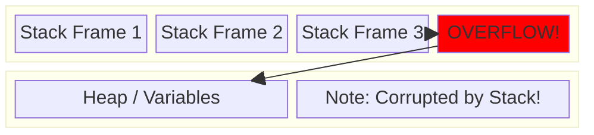
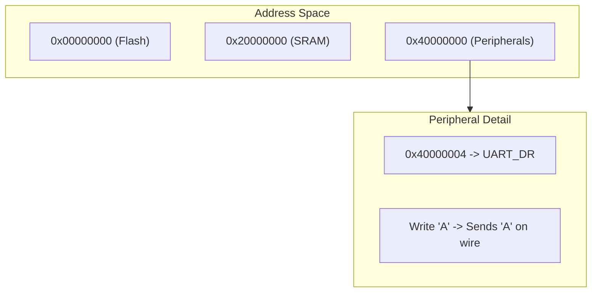
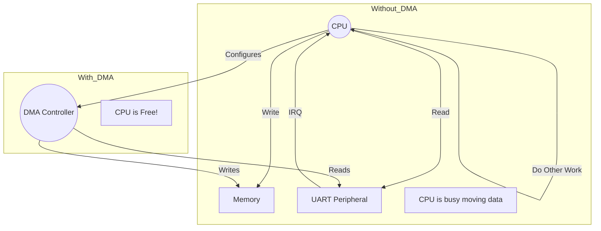
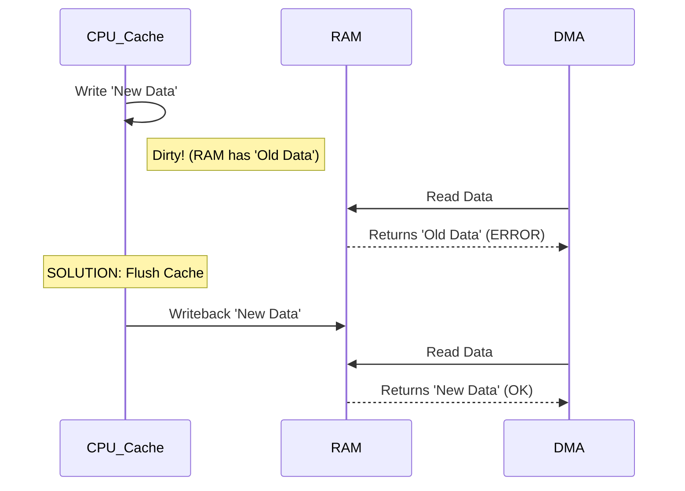

# 🧠 Part 3: Memory Management (Questions 31-45)

## 📌 Question 31: Typical Embedded Memory Layout

### 💡 The Concept

An embedded program isn't just one blob. It's divided into sections based on how the memory behaves.

1.  **.text**: Code (Instructions). Read-Only. (Flash)
2.  **.rodata**: Constants `const int x = 5;`. Read-Only. (Flash)
3.  **.data**: Initialized Globals `int x = 5;`. Read-Write. (RAM, copied from Flash at startup).
4.  **.bss**: Zero-Initialized Globals `int x;`. Read-Write. (RAM, zeroed at startup).
5.  **Heap**: Manual allocation. (RAM)
6.  **Stack**: Function locals. (RAM)

### 🖼️ Visualization (Memory Map)



---

## 📌 Question 32: What happens in "Startup Code" (crt0)?

### 💡 The Concept

Before `main()` runs, a small assembly program (usually `startup.s`) sets up the environment.

### 🖼️ Visualization (Startup Sequence)



---

## 📌 Question 33: Stack Overflow

### 💡 The Concept

When the **Stack** grows too large (too many nested calls or big local arrays) and overwrites the **Heap** or other variables.
**Symptoms**: Random crashes, variables changing mysteriously.

### 🖼️ Visualization



---

## 📌 Question 34: Memory Alignment

### 💡 The Concept

Processors fetch data faster (or only) at aligned addresses (e.g., 4-byte boundaries like 0x00, 0x04, 0x08). Accessing a 4-byte int at address 0x01 might cause a **Hard Fault** or be very slow.

### 🖼️ Visualization


---

## 📌 Question 35: `malloc` in Embedded (Why avoid it?)

### 💡 The Concept

1.  **Fragmentation**: Frequent allocate/free creates gaps too small to use.
2.  **Determinism**: `malloc` search time varies. Bad for Real-Time.
3.  **Failures**: Handling `NULL` return gracefully is hard in embedded.

### 🖼️ Visualization (Fragmentation)


---

## 📌 Question 36: Flash vs EEPROM vs RAM

### 💡 The Concept

- **RAM**: Volatile. Fast. Work area. (Lost on power off).
- **Flash**: Non-volatile. Block-erase only. Code storage/Firmware.
- **EEPROM**: Non-volatile. Byte-erase. Config/Parameter storage.

---

## 📌 Question 37: Memory Mapped I/O

### 💡 The Concept

Hardware peripherals (UART, GPIO) look like Memory Addresses to the CPU. Writing to address `0x40001000` isn't writing to RAM, it's turning on an LED.

### 🖼️ Visualization



### 💻 Code Example

```c
// Define pointer to hardware address
#define UART_DR  (*((volatile uint32_t *) 0x40001004))

void send_char(char c) {
    UART_DR = c; // Looks like memory write, acts like hardware IO
}
```

---

## 📌 Question 38: DMA (Direct Memory Access)

### 💡 The Concept

A separate hardware unit that copies data between Memory and Peripherals **without** the CPU. CPU is free to do other math.

### 🖼️ Visualization



---

## 📌 Question 39: Buffer Overrun

### 💡 The Concept

Writing past the end of an array.
In embedded, this is dangerous because you might overwrite return addresses (Stack Smash) or critical hardware configuration bits.

### 💻 Code Example

```c
char buf[4];
strcpy(buf, "HELLO");
// 'H','E','L','L','O','\0' -> 6 bytes!
// Bytes 5 and 6 overwrite whatever memory was next to 'buf'.
```

---

## 📌 Question 40: Cache Coherency (Advanced)

### 💡 The Concept

If you use DMA:

1.  CPU writes data to Cache (Status=Dirty), not yet to RAM.
2.  DMA reads from RAM (Old data!).
    **Fix**: You must "Flush" or "Clean" cache before starting DMA.

### 🖼️ Visualization



---

## 📌 Question 41: TCM (Tightly Coupled Memory)

### 💡 The Concept

Small, ultra-fast memory physically next to the CPU core. Deterministic access (no cache misses). Used for critical Interrupt routines or DSP loops.

---

## 📌 Question 42: The "Null Pointer Dereference"

### 💡 The Concept

Accessing `*ptr` when `ptr == NULL (0)`.
In many microcontrollers, address `0` is actually valid (It's often the vector table!).
Writing to `0` can corrupt the system reset vector, bricking the device until reprogramming.

Modern MPUs protect page 0 to catch this.

---

## 📌 Question 43: Overlaying Memory (Unions)

### 💡 The Concept

Using `union` to view the same memory as different types. Useful for parsing binary packets.

### 💻 Code Example

```c
union Packet {
    uint32_t raw_value;
    struct {
        uint8_t header;
        uint8_t payload;
        uint16_t checksum;
    } fields;
};
```

---

## 📌 Question 44: Static Allocation vs Dynamic

### 💡 The Concept

**Embedded Rule of Thumb**: Allocate everything statically (at compile time) if possible.

- **Static**: `int buffer[1024];` (Safe, predictable, wastes space if unused).
- **Dynamic**: `malloc(size);` (Flexible, dangerous).

Most safety-critical standards (MISRA C) forbid malloc.

---

## 📌 Question 45: What is `.bss`?

### 💡 The Concept

Blocked Started by Symbol. It holds **Uninitialized Global Variables**.
Why is it a separate section?
Because it doesn't take up space in the Flash binary. We just need to know "Reserve 1000 bytes", and the startup code fills it with zeros.

**Flash Savings**: A 1MB zero-initialized array takes 0 bytes in Flash, but 1MB in RAM.
