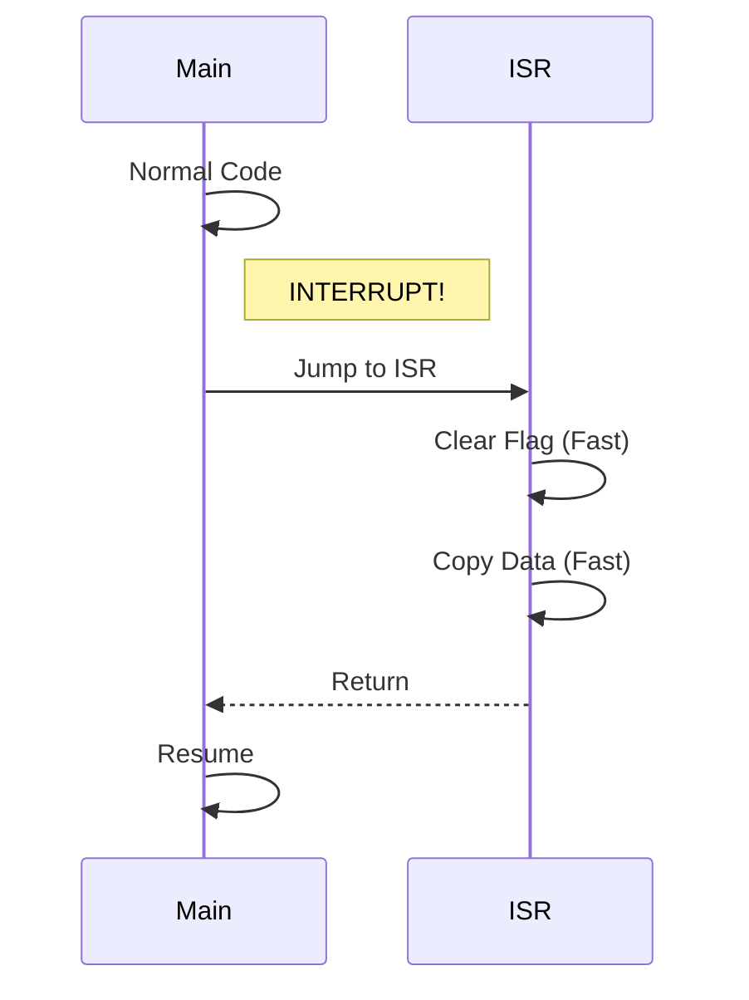
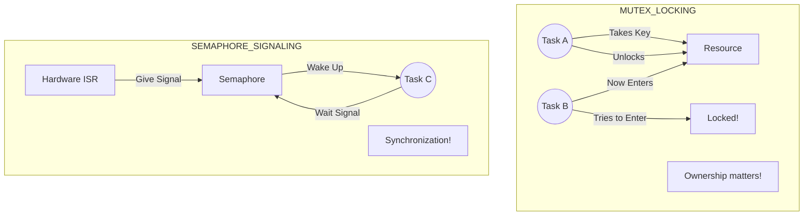
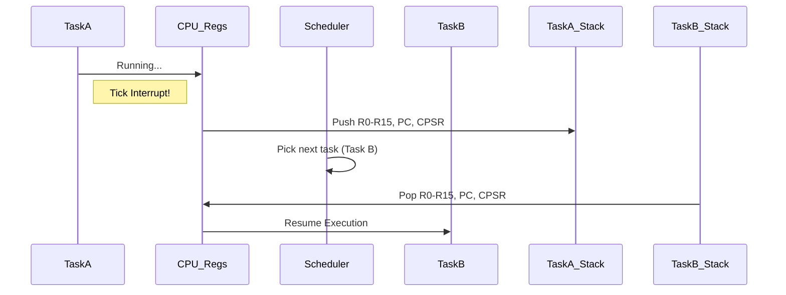
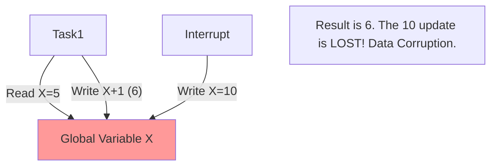
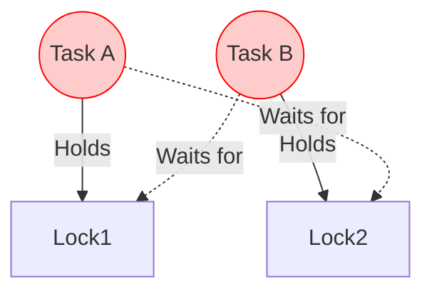
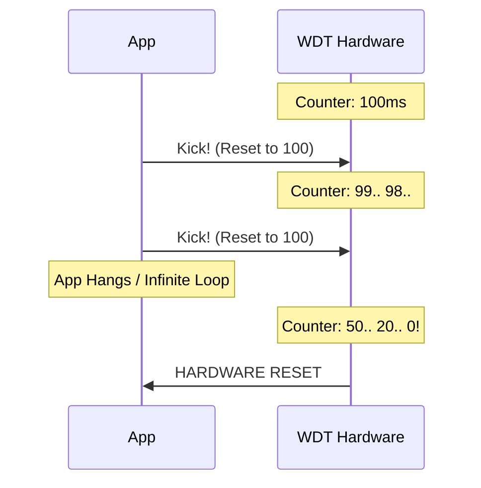

# 🧠 Part 4: RTOS & Concurrency (Questions 46-60)

## 📌 Question 46: Bare Metal vs RTOS

### 💡 The Concept

- **Bare Metal**: Super loop architecture (`while(1)`). Simple, low overhead, hard to manage complex timing.
- **RTOS (Real-Time OS)**: Scheduler manages Tasks. Deterministic. Overhead (Ticks, Context Switches).

### 🖼️ Visualization

```mermaid
graph TD
    subgraph Bare_Metal
        S1[Start] --> Loop{while(1)}
        Loop --> TaskA[Check Sensor]
        TaskA --> TaskB[Update Display]
        TaskB --> TaskC[Process UART]
        TaskC --> Loop
        Note1[If Sensor hangs, Display freezes!]
    end

    subgraph RTOS
        Sched((Scheduler))
        Sched -.-> T1[Task A (Sensor)]
        Sched -.-> T2[Task B (Display)]
        Sched -.-> T3[Task C (UART)]
        Note2[Scheduler switches tasks periodically]
    end
```

---

## 📌 Question 47: Valid ISR Actions (What NOT to do)

### 💡 The Concept

An ISR (Interrupt Service Routine) blocks the main code. It must be **SHORT** and **FAST**.

**NEVER DO** inside ISR:

1.  `printf()` (It's slow and uses blocking IO).
2.  `malloc()` (Non-deterministic, thread-unsafe).
3.  Wait loops / delays.
4.  Semaphores waits (Blocking).

### 🖼️ Visualization



---

## 📌 Question 48: Mutex vs Binary Semaphore

### 💡 The Concept

The #1 Embedded Interview Question.

- **Mutex**: For **locking** resources (ownership). Only the owner can unlock it. Has Priority Inheritance.
- **Semaphore**: For **signaling** events. Task A can wait, ISR can give. No ownership.

### 🖼️ Visualization (The Bathroom Key vs The Flag)



---

## 📌 Question 49: Priority Inversion

### 💡 The Concept

A Low-priority task holds a resource. A High-priority task waits for it. Mid-priority task preempts the Low task.
Result: **High priority task is blocked by Medium priority task!** (Mars Pathfinder Bug).

### 🖼️ Visualization

L = Low, M = Medium, H = High, R = Resource

```mermaid
gantt
    title Priority Inversion Scenario
    dateFormat s
    axisFormat %S

    section Low Task
    Acquire R :active, 0, 5
    Preempted by M :crit, 5, 5
    Release R : 10, 2

    section Med Task
    Runs (Blocking L!) :active, 5, 5

    section High Task
    Needs R (Blocked) :crit, 2, 8
    Runs : 12, 3
```



**Solution**: **Priority Inheritance** (Low task temporarily raised to High priority while holding lock).

---

## 📌 Question 50: Context Switching

### 💡 The Concept

The process of saving the state (CPU registers) of the current task and restoring the state of the next task.
It takes time (overhead).

### 🖼️ Visualization



---

## 📌 Question 51: Reentrancy

### 💡 The Concept

A function is **reentrant** if it can be interrupted in the middle, called again (by ISR or another thread), and then resume safely without data corruption.
**Non-reentrant**: Functions that use `static` or `global` variables. `strtok()` is notoriously non-reentrant.

### 🖼️ Visualization



---

## 📌 Question 52: Deadlock

### 💡 The Concept

Two tasks waiting for each other forever.
Task A has Resource 1, wants Resource 2.
Task B has Resource 2, wants Resource 1.

### 🖼️ Visualization



**Prevention**: Always acquire locks in the same order (Hierarchy).

---

## 📌 Question 53: Producer-Consumer Problem

### 💡 The Concept

One task produces data (puts in buffer), another consumes it. Need to handle "Buffer Full" and "Buffer Empty" race conditions.
Solution: Circular Buffer (Ring Buffer) or Message Queues.

---

## 📌 Question 54: Critical Section

### 💡 The Concept

A piece of code that accesses shared resources and **must not be interrupted**.
Protected by:

1.  Disabling Interrupts (`__disable_irq()`) - Fast, but affects latency.
2.  Mutexes.
3.  Spinlocks (Multi-core).

---

## 📌 Question 55: Watchdog Timer (WDT)

### 💡 The Concept

A hardware timer that counts down. If it reaches 0, it resets the MCU.
The software must "kick" (reset) the dog periodically to prove it's still running correctly.

### 🖼️ Visualization



---

## 📌 Question 56: Jitter

### 💡 The Concept

The variation in timing.
If a task is scheduled to run every 10ms:
Run 1: 10.0ms
Run 2: 10.1ms
Run 3: 9.9ms
Run 4: 10.05ms

Critical for Audio/Motor Control. RTOS reduces jitter compared to bare metal but doesn't eliminate it (interrupts cause jitter).

---

## 📌 Question 57: Co-operative vs Preemptive Scheduler

### 💡 The Concept

- **Preemptive**: Scheduler can force-stop a task to run a higher priority one (Timer interrupt). Standard for RTOS.
- **Co-operative**: Task must explicitly yield (`task_yield()`). If a task hangs, the whole system hangs.

---

## 📌 Question 58: Spinlock vs Mutex

### 💡 The Concept

- **Mutex**: If locked, the thread **sleeps** (context switches). Good for long waits.
- **Spinlock**: If locked, the thread **loops** checking "Is it free?" repeatedly. Good for very short waits (saves context switch overhead) but burns CPU.

---

## 📌 Question 59: Race Condition

### 💡 The Concept

Output depends on the sequence or timing of uncontrollable events (threads).
Common bug: `count++` is not atomic. It is:

1. Load count
2. Add 1
3. Store count

If interrupt happens between 1 and 3, updates are lost.

---

## 📌 Question 60: Atomic Operations

### 💡 The Concept

An operation that cannot be interrupted.
Hardware often provides special instructions (e.g., `LDREX`/`STREX` on ARM) to perform atomic read-modify-write cycles.
