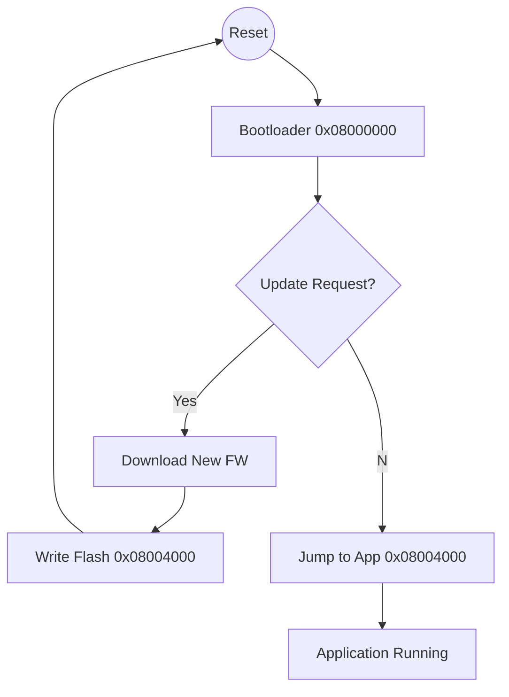

# 🧠 Part 5: Systems & Protocols (Questions 61-75)

## 📌 Question 61: I2C vs SPI vs UART (Comparison)

### 💡 The Concept

The "Big Three" embedded protocols.

| Feature        | UART (Serial)       | I2C (Inter-Integrated Circuit) | SPI (Serial Peripheral Interface) |
| :------------- | :------------------ | :----------------------------- | :-------------------------------- |
| **Wires**      | 2 (TX, RX)          | 2 (SDA, SCL)                   | 4 (MISO, MOSI, SCK, CS)           |
| **Speed**      | Slow (Kbits)        | Medium (100k-3.4M)             | Fast (Mbits - 50M+)               |
| **Duplex**     | Full                | Half                           | Full                              |
| **Addressing** | No (Point-to-Point) | Yes (7-bit address)            | Hardware (Chip Select)            |
| **Push/Pull**  | Push-Pull           | Open-Drain (Needs Pull-ups)    | Push-Pull                         |

### 🖼️ Visualization (Topology)

```mermaid
graph TD
    subgraph UART
        Dev1[Device A] <-->|TX-RX| Dev2[Device B]
        Note1[Point to Point]
    end

    subgraph I2C
        Master --SDA/SCL--> Bus((Bus Line))
        Bus --> Slave1
        Bus --> Slave2
        Bus --> Slave3[Slave 3 (Addr 0x50)]
        Note2[Multi-Drop]
    end

    subgraph SPI
        M[Master] --CS1--> S1[Slave 1]
        M --CS2--> S2[Slave 2]
        M ==>|MOSI/MISO/SCK| Bus2
        Bus2 ==> S1
        Bus2 ==> S2
        Note3[Fastest]
    end
```

---

## 📌 Question 62: Explain I2C "Open Drain" & Pull-ups

### 💡 The Concept

In I2C, devices **never drive logic 1**. They only pull the line to **0 (GND)** or "let go" (Float).
A external resistor pulls the line to 1 when everyone lets go.
**Why?** Allows multiple masters without short circuits (if one drives 1 and other drives 0 → Short!).

### 🖼️ Visualization

```mermaid
graph BT
    VCC --Resistor--> Line[SDA Line]
    DevA --Switch--> GND
    DevB --Switch--> GND

    Note[Default: Line is HIGH (VCC). Getting LOW requires Pull-Down.]
```

---

## 📌 Question 63: SPI Modes (CPOL/CPHA)

### 💡 The Concept

SPI has 4 modes based on Clock Polarity (CPOL) and Phase (CPHA).

- **CPOL**: Idle Low (0) or Idle High (1).
- **CPHA**: Sample on Leading Edge (0) or Trailing Edge (1).

If Master & Slave mismatch modes → Communication fails (Garbage data).

---

## 📌 Question 64: UART Framing Error

### 💡 The Concept

UART is asynchronous (no clock wire). Receiver guesses the timing based on baud rate.
If timing drifts, the receiver might sample the Stop Bit as '0' instead of '1'. This is a **Framing Error**.

### 🖼️ Visualization

```mermaid
block-beta
    columns 10
    block:Correct
    Start D0 D1 D2 D3 D4 D5 D6 D7 Stop
    end

    block:Drifting
    Start D0 D1 D2 D3 D4 D5 D6 ... ...
    Note: "Receiver looks for Stop here but sees Data!"
    end
```

---

## 📌 Question 65: Debouncing (Switch Bounce)

### 💡 The Concept

Mechanical buttons don't close cleanly. They "bounce" (on-off-on-off) for 10-20ms.
A fast ISR will detect 50 presses!
**Solution**: Hardware RC filter OR Software Timer (Wait 20ms and check again).

### 🖼️ Visualization

```mermaid
xychart-beta
    title "Button Signal Reality"
    x-axis [0ms, 5ms, 10ms, 15ms, 20ms]
    y-axis "Voltage" 0 --> 1
    line [0, 1, 0, 1, 0, 0.5, 1, 1]

    check "ISR Firing" [0, 1, 0, 1, 0, 0, 1, 0]

    text "Stable" at 20ms
```

---

## 📌 Question 66: Differential Signaling (RS485/CAN)

### 💡 The Concept

Instead of 1 wire (0V/5V), uses 2 wires (A and B).
Value = `Voltage(A) - Voltage(B)`.
**Why?** Noise cancellation! If noise spikes both wires, the _difference_ remains valid. Used in industrial/automotive.

---

## 📌 Question 67: Can you use Floats in ISR?

### 💡 The Concept

**Generally, NO.**

1.  Floating Point Unit (FPU) registers are huge. Saving/Restoring them on stack takes time (Latency).
2.  Some compilers don't save FPU state in ISRs by default → Corruption of main thread calculation.
3.  Floats are slow.

---

## 📌 Question 68: What is a Bootloader?

### 💡 The Concept

A small program that runs before the Application.
It checks: "Do I need to update firmware?" (e.g., via UART/USB).
If Yes: Downloads new code to Flash.
If No: Jumps to Application.

### 🖼️ Visualization



---

## 📌 Question 69: Watchpoint vs Breakpoint

### 💡 The Concept

- **Breakpoint**: Stop CPU when it executes code at Address X.
- **Watchpoint**: Stop CPU when it **Reads/Writes** data variable Y. (Great for finding "Who is corrupting this variable?").

---

## 📌 Question 70: ADC (Analog to Digital)

### 💡 The Concept

Converts voltage (0-3.3V) to number (0-4095 for 12-bit).
**Sampling Theorem**: Sampling frequency must be > 2x Signal Frequency (Nyquist). Aliasing occurs if slower.

---

## 📌 Question 71: IO Polling vs Interrupt vs DMA

### 💡 The Concept

How to read a sensor?

1.  **Polling**: `while(!ready);` Burns CPU. Latency = undefined.
2.  **Interrupt**: Hardware wakes CPU. Low latency. Context switch overhead.
3.  **DMA**: Hardware writes to RAM. Zero CPU usage. High throughput.

---

## 📌 Question 72: What is the Vector Table?

### 💡 The Concept

A specific area in memory (usually start of Flash) containing addresses of all ISR handlers.
`[Reset_Handler, NMI_Handler, HardFault_Handler, ..., SysTick_Handle]`
When hardware triggers IRQ #5, CPU looks up entry #5 in this table and jumps there.

---

## 📌 Question 73: Stack Frame (Context)

### 💡 The Concept

When a function is called (or ISR runs), CPU pushes registers onto the Stack.
Typically: `R0-R3, R12, LR, PC, xPSR`.
Understanding this is vital for debugging **Hard Faults**. You can look at the stack to see _where_ the crash happened (PC).

---

## 📌 Question 74: Bit-Banging

### 💡 The Concept

Simulating a protocol (like I2C or UART) purely in software by toggling GPIOs manually.
Useful when hardware peripheral is broken/occupied.
Cons: High CPU usage, timing jitter, difficult to reach high speeds.

---

## 📌 Question 75: Cross-Compilation

### 💡 The Concept

Compiling code on Machine A (x86 Mainframe/PC) to run on Machine B (ARM Cortex-M).
Toolchain: `arm-none-eabi-gcc`.
You cannot run the output `.elf` file on your laptop. You need an emulator (QEMU) or actual hardware.
